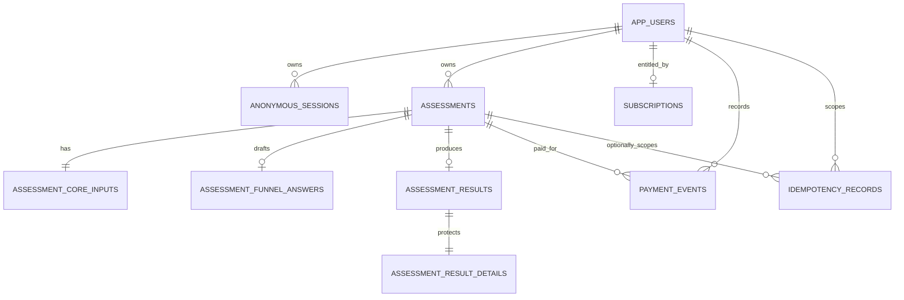

# Health Assessment Funnel

[](https://github.com/RomanticD/health-assessment-funnel/actions/workflows/ci.yml)

这是一个面向真实产品场景的健康测评漏斗：支持可恢复的答题进度、并发控制、服务端健康计算，以及按订阅权益返回不同结果。匿名用户完成 15 步测评后，服务端会持久化进度、计算 BMI、能量建议与目标预测，并根据当前订阅状态返回结构明确区分的 preview/full DTO。

> 结果仅提供一般性的健康生活方式估算，不构成医疗诊断、治疗建议或个体化临床意见。

## Live environment

- Web：<https://health-assessment-funnel.vercel.app>
- Result access and checkout page（固定合成数据）：<https://health-assessment-funnel.vercel.app/demo/paywall>
- GitHub：<https://github.com/RomanticD/health-assessment-funnel>
- 健康检查：<https://health-assessment-funnel.vercel.app/api/health>
- API reference（Swagger UI）：<https://health-assessment-funnel.vercel.app/api-docs>
- OpenAPI 3.1 document：<https://health-assessment-funnel.vercel.app/openapi.yaml>
- Supabase project ref：`kfyqgzuatywmsuruwsei`
- Pre-authorized paid session（已完成 15 题、已提交、已激活测试订阅，数据库身份为 `demo_readonly`）：
  - `sessionId`: `Cm4dsRc3ybdSeNc3CPYuHVumgLi4HLQ6lnWy_s0eOAY`
  - `assessmentId`: `2378aded-3fab-4ed5-a958-ac73d09dddad`
  - 有效期至：`2026-10-22T11:46:35Z`（公开 fixture 30 天轮换窗口）

使用下面的只读请求即可查看完整会员结果；同一个 assessment 不带这个 session 或使用未支付 session 时，结果接口只返回 `access: "preview"` 和 `lockedFeatures`。

```bash
BASE="https://health-assessment-funnel.vercel.app"
SESSION_ID="Cm4dsRc3ybdSeNc3CPYuHVumgLi4HLQ6lnWy_s0eOAY"
ASSESSMENT_ID="2378aded-3fab-4ed5-a958-ac73d09dddad"

curl "$BASE/api/v1/assessments/$ASSESSMENT_ID/result" \
  -H "Authorization: Bearer $SESSION_ID"
```

要在一个尚未支付的 session 上重放支付闭环，请先把下面的 `SESSION_ID` / `ASSESSMENT_ID` 换成该 session，并完成提交；然后调用（`Idempotency-Key` 每次请求使用 16–128 位稳定值）：

```bash
curl -X POST "$BASE/api/v1/pay" \
  -H "Authorization: Bearer $SESSION_ID" \
  -H "Content-Type: application/json" \
  -H "Idempotency-Key: subscription-activation-20260922" \
  --data '{"assessmentId":"'"$ASSESSMENT_ID"'","planCode":"demo_monthly"}'
```

## 体验路径

```text
Landing
  → 创建/恢复匿名 session
  → 15 个逐题保存的问题（目标、经验、习惯、偏好、身体数据）
  → review + 服务端计算
  → preview（无敏感预测字段 + 毛玻璃锁定预览）
  → checkout activation
  → full result（即时解锁）
```

前端不在 Web Storage 保存健康答案或 bearer credential。刷新和跨设备 CLI 恢复以服务端状态为准；写请求使用 ETag/`If-Match` 防止静默覆盖，并用 `Idempotency-Key` 安全重放。

题目地址只表达导航状态（例如 `/quiz/ageYears`、`/quiz/review`）；结果路径中的 assessment UUID 也不是授权凭证。复制到没有原 HttpOnly Cookie 的浏览器不会读取结果。完整运行入口、截图、测试位置和 release evidence 见 [delivery/README.md](./delivery/README.md)。

## 技术栈与工程边界

- Next.js 16 App Router、React 19、TypeScript strict、Zod 4
- Next.js Route Handlers + framework-light application/domain layer
- Supabase PostgreSQL 17：forward-only migration、事务 RPC、显式 ACL/RLS
- 256-bit opaque anonymous session；数据库只保存 SHA-256 digest
- Vitest + 真实本地 PostgreSQL integration + Playwright
- GitHub Actions（Node 22）+ Vercel

依赖方向：

```text
UI / HTTP Route Handlers
          ↓
application use cases → domain algorithm / contracts
          ↓
Supabase RPC adapter → PostgreSQL transaction RPCs
```

## 一键启动

前置条件：Node.js 22、pnpm 10.10+、Docker Desktop。

```bash
pnpm install --frozen-lockfile
cp .env.example .env.local
pnpm supabase:start
pnpm db:reset
pnpm dev
```

`.env.local`：

```dotenv
APP_ORIGIN=http://localhost:3000
SUPABASE_URL=http://127.0.0.1:54321
SUPABASE_SECRET_KEY=<local `supabase status` 输出的 secret/service-role key>
VERCEL_GIT_COMMIT_SHA=local
```

`SUPABASE_SECRET_KEY` 只允许存在于 server runtime，禁止 `NEXT_PUBLIC_` 前缀，也不得提交到 Git。

## 验证命令

```bash
pnpm format:check
pnpm lint
pnpm typecheck
pnpm test
pnpm test:integration
pnpm test:e2e
pnpm build
```

完整测试矩阵、真实数据库启动方式和暂未覆盖项见 [tests/README.md](./tests/README.md)。当前主机 Node 23 下默认 Turbopack 的 CSS worker 受沙箱 IPC 限制时，可用 `pnpm exec next build --webpack` 做等价 production build；CI/Vercel 固定 Node 22 运行标准 `pnpm build`。

GitHub Actions 明确运行 Playwright：`integration-e2e` job 先安装 Chromium，再执行 `pnpm test:stack`；该命令会启动本地 Supabase 和 Next.js，依次运行真实 PostgreSQL integration suite 与 `playwright test`。每次运行都会上传 HTML report 和 test results，失败时额外保留 trace、截图与视频；CI 将 flaky test 视为失败。`quality` job 独立运行 format、lint、typecheck、coverage 与 production build。

## API 快速参考

所有业务端点位于 `/api/v1`：

| Method | Path                                | 作用                         |
| ------ | ----------------------------------- | ---------------------------- |
| `POST` | `/sessions`                         | 创建或复用匿名 session       |
| `POST` | `/assessments`                      | 创建或复用当前 assessment    |
| `GET`  | `/assessments/current`              | 恢复当前进度                 |
| `GET`  | `/assessments/{id}`                 | 读取指定 assessment          |
| `PUT`  | `/assessments/{id}/steps/{stepKey}` | 保存一步，要求 ETag + 幂等键 |
| `POST` | `/assessments/{id}/submit`          | 原子校验、计算并持久化结果   |
| `GET`  | `/assessments/{id}/result`          | 返回 preview 或 full DTO     |
| `POST` | `/pay`                              | 模拟支付并激活订阅           |

浏览器使用 HttpOnly Cookie；cURL/Postman 使用 `Authorization: Bearer <sessionId>`。成功响应统一为 `{ "data": ... }`，失败响应使用 RFC 7807 `application/problem+json`。完整字段、状态码、错误码与可重放 cURL 见 [docs/api.md](./docs/api.md)。

## 数据模型



核心答案使用强类型列与数据库 `CHECK`；公开 preview 与付费 details 物理拆表。浏览器角色没有业务表/RPC 权限，Next.js server 通过受限 RPC 访问。完整字段、关系和状态不变量见 [docs/database.md](./docs/database.md)。

## 项目文档

- [plan/README.md](./plan/README.md)：需求追踪、技术选型和架构决策
- [plan/15-product-experience-revision.md](./plan/15-product-experience-revision.md)：产品经理复审、15 题体验重设计与新增持久化
- [src/app/README.md](./src/app/README.md)：前端 funnel、设计系统、可访问性与交互状态
- [src/server/README.md](./src/server/README.md)：后端模块、认证、并发和扩展点
- [supabase/README.md](./supabase/README.md)：迁移、连接、权限模型与数据库操作
- [docs/api.md](./docs/api.md)：API 合约与完整 cURL 示例
- [在线 API reference](https://health-assessment-funnel.vercel.app/api-docs)：Swagger UI 交互文档
- [在线 OpenAPI 3.1 document](https://health-assessment-funnel.vercel.app/openapi.yaml)：可下载并导入工具
- [docs/openapi.yaml](./docs/openapi.yaml)：仓库内版本化的 OpenAPI 3.1 合约
- [docs/database.md](./docs/database.md)：Schema、ERD 与数据库不变量
- [docs/deployment.md](./docs/deployment.md)：Supabase/Vercel/CI 部署与回滚
- [docs/ai-retrospective.md](./docs/ai-retrospective.md)：AI 协作方法、验证证据和一次明确否决
- [tests/README.md](./tests/README.md)：自动化测试覆盖与限制

## 关键设计取舍

- 进度是服务端权威状态；客户端无法用 URL 或本地缓存伪造完成步骤。
- assessment revision 使用乐观并发控制；相同幂等请求优先重放，乱序和冲突返回稳定错误码。
- 健康算法只在服务端执行，输入与算法版本一并固化，结果不可变。
- preview/full 分别从 allowlist 构造，非会员响应不会先获得完整对象再 `delete` 字段。
- `/pay` 不接收金额、用户 ID 或订阅状态，只能为当前 session 所属且已完成的 assessment 激活固定测试 plan。

## 已知范围

- 当前支付适配器执行测试订阅激活，不连接外部支付渠道；接入生产支付商时必须验证 provider signature、事件顺序和退款/撤销。
- 普通匿名 session 为 7 天绝对 TTL；公开只读 fixture 使用独立 30 天轮换窗口。当前没有账号迁移、邮件登录或跨浏览器同步。
- 算法提供透明、确定性的 wellness 估算，不处理孕期、疾病、药物或临床营养方案。
- 当前版本聚焦数据流、并发、权限与测试闭环；分布式速率限制和长期数据清理任务属于后续生产强化项。
