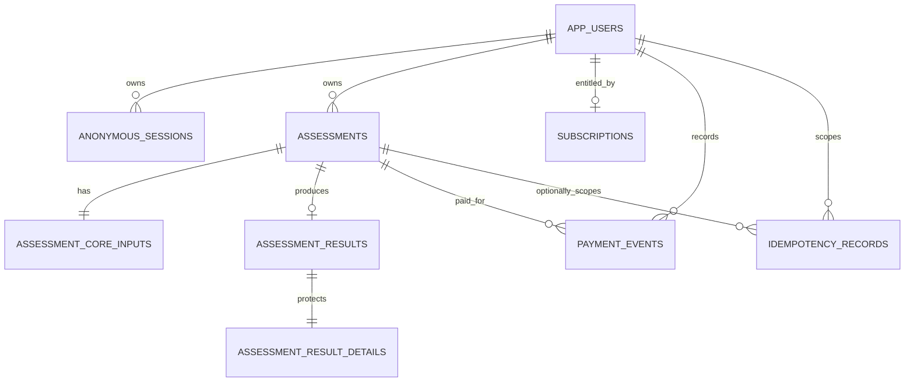

# Health Assessment Funnel

睿迄科技全栈挑战的完整交付：一个可恢复、可并发控制、可模拟订阅解锁的健康测评 funnel。匿名访客逐步填写答案，服务端持久化进度并计算 BMI、建议摄入量与目标预测；结果接口按实时订阅状态返回结构不同的 preview/full DTO。

> 本项目用于工程演示与健康教育，不构成医疗诊断、治疗或个体化医学建议。

## 在线交付

- Web：<https://health-assessment-funnel.vercel.app>
- GitHub：<https://github.com/RomanticD/health-assessment-funnel>（private）
- 健康检查：<https://health-assessment-funnel.vercel.app/api/health>
- Supabase project ref：`kfyqgzuatywmsuruwsei`
- Paid demo session：将在生产全链路验收后写入此处，并同时给出对应 `assessmentId`。

## 体验路径

```text
Landing
  → 创建/恢复匿名 session
  → 性别 → 目标 → 身体数据 → 活动频率
  → review + 服务端计算
  → preview（无敏感预测字段）
  → mock pay
  → full result（即时解锁）
```

前端不在 Web Storage 保存健康答案或 bearer credential。刷新和跨设备 CLI 恢复以服务端状态为准；写请求使用 ETag/`If-Match` 防止静默覆盖，并用 `Idempotency-Key` 安全重放。

## 技术栈与工程边界

- Next.js 16 App Router、React 19、TypeScript strict、Zod 4
- Next.js Route Handlers + framework-light application/domain layer
- Supabase PostgreSQL 17：forward-only migration、事务 RPC、显式 ACL/RLS
- 256-bit opaque anonymous session；数据库只保存 SHA-256 digest
- Vitest + 真实本地 PostgreSQL integration + Playwright
- GitHub Actions（Node 22）+ Vercel

依赖方向：

```text
UI / HTTP Route Handlers
          ↓
application use cases → domain algorithm / contracts
          ↓
Supabase RPC adapter → PostgreSQL transaction RPCs
```

## 一键启动

前置条件：Node.js 22、pnpm 10.10+、Docker Desktop。

```bash
pnpm install --frozen-lockfile
cp .env.example .env.local
pnpm supabase:start
pnpm db:reset
pnpm dev
```

`.env.local`：

```dotenv
APP_ORIGIN=http://localhost:3000
SUPABASE_URL=http://127.0.0.1:54321
SUPABASE_SECRET_KEY=<local `supabase status` 输出的 secret/service-role key>
VERCEL_GIT_COMMIT_SHA=local
```

`SUPABASE_SECRET_KEY` 只允许存在于 server runtime，禁止 `NEXT_PUBLIC_` 前缀，也不得提交到 Git。

## 验证命令

```bash
pnpm format:check
pnpm lint
pnpm typecheck
pnpm test
pnpm test:integration
pnpm test:e2e
pnpm build
```

完整测试矩阵、真实数据库启动方式和暂未覆盖项见 [tests/README.md](./tests/README.md)。当前主机 Node 23 下默认 Turbopack 的 CSS worker 受沙箱 IPC 限制时，可用 `pnpm exec next build --webpack` 做等价 production build；CI/Vercel 固定 Node 22 运行标准 `pnpm build`。

## API 快速参考

所有业务端点位于 `/api/v1`：

| Method | Path                                | 作用                         |
| ------ | ----------------------------------- | ---------------------------- |
| `POST` | `/sessions`                         | 创建或复用匿名 session       |
| `POST` | `/assessments`                      | 创建或复用当前 assessment    |
| `GET`  | `/assessments/current`              | 恢复当前进度                 |
| `GET`  | `/assessments/{id}`                 | 读取指定 assessment          |
| `PUT`  | `/assessments/{id}/steps/{stepKey}` | 保存一步，要求 ETag + 幂等键 |
| `POST` | `/assessments/{id}/submit`          | 原子校验、计算并持久化结果   |
| `GET`  | `/assessments/{id}/result`          | 返回 preview 或 full DTO     |
| `POST` | `/pay`                              | 模拟支付并激活订阅           |

浏览器使用 HttpOnly Cookie；cURL/Postman 使用 `Authorization: Bearer <sessionId>`。成功响应统一为 `{ "data": ... }`，失败响应使用 RFC 7807 `application/problem+json`。完整字段、状态码、错误码与可重放 cURL 见 [docs/api.md](./docs/api.md)。

## 数据模型



核心答案使用强类型列与数据库 `CHECK`；公开 preview 与付费 details 物理拆表。浏览器角色没有业务表/RPC 权限，Next.js server 通过受限 RPC 访问。完整字段、关系和状态不变量见 [docs/database.md](./docs/database.md)。

## 项目文档

- [plan/README.md](./plan/README.md)：需求追踪、技术选型和两天执行计划
- [src/app/README.md](./src/app/README.md)：前端 funnel、设计系统、可访问性与交互状态
- [src/server/README.md](./src/server/README.md)：后端模块、认证、并发和扩展点
- [supabase/README.md](./supabase/README.md)：迁移、连接、权限模型与数据库操作
- [docs/api.md](./docs/api.md)：API 合约与完整 cURL 演示
- [docs/database.md](./docs/database.md)：Schema、ERD 与数据库不变量
- [docs/deployment.md](./docs/deployment.md)：Supabase/Vercel/CI 部署与回滚
- [docs/ai-retrospective.md](./docs/ai-retrospective.md)：AI 协作方法、验证证据和一次明确否决
- [tests/README.md](./tests/README.md)：自动化测试覆盖与限制

## 关键设计取舍

- 进度是服务端权威状态；客户端无法用 URL 或本地缓存伪造完成步骤。
- assessment revision 使用乐观并发控制；相同幂等请求优先重放，乱序和冲突返回稳定错误码。
- 健康算法只在服务端执行，输入与算法版本一并固化，结果不可变。
- preview/full 分别从 allowlist 构造，非会员响应不会先获得完整对象再 `delete` 字段。
- `/pay` 不接收金额、用户 ID 或订阅状态，只能为当前 session 所属且已完成的 assessment 激活固定 demo plan。

## 已知范围

- 支付是题目要求的 mock callback，不连接真实支付渠道；真实系统需验证 provider signature、事件顺序和退款/撤销。
- 匿名 session 为 7 天绝对 TTL；没有账号迁移、邮件登录或跨浏览器同步。
- 算法是透明、确定性的教育型估算，不处理孕期、疾病、药物或临床营养方案。
- 速率限制和长期数据清理属于生产强化项；本挑战重点证明数据流、并发、权限和测试闭环。
