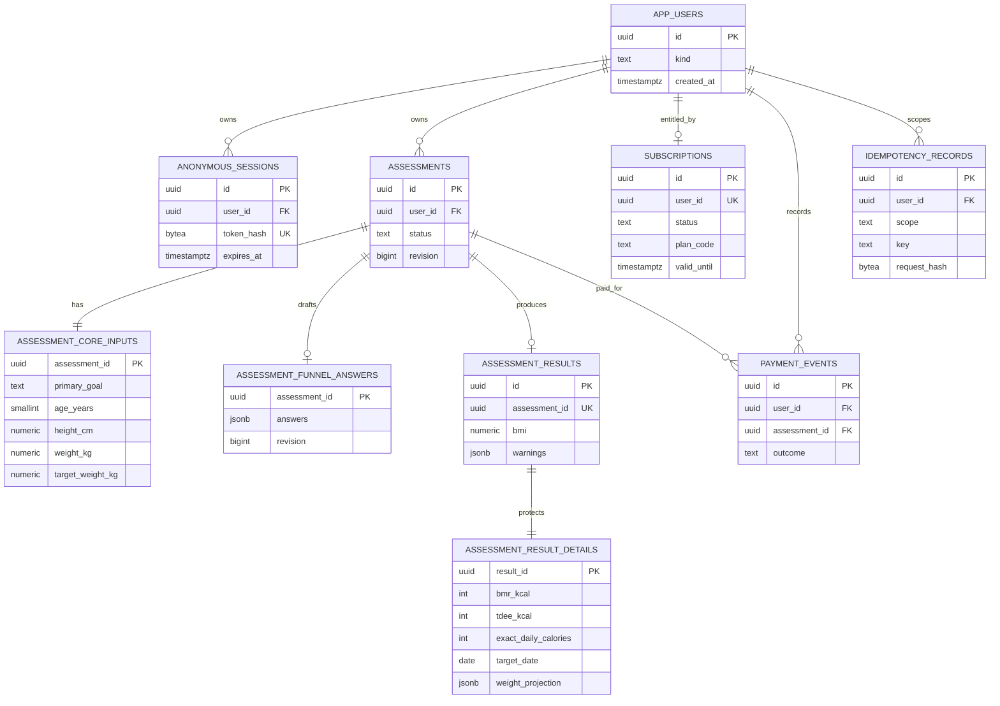

# Assessment ERD

```mermaid
erDiagram
  APP_USERS ||--o{ ANONYMOUS_SESSIONS : owns
  APP_USERS ||--o{ ASSESSMENTS : owns
  ASSESSMENTS ||--|| ASSESSMENT_CORE_INPUTS : has
  ASSESSMENTS ||--o| ASSESSMENT_FUNNEL_ANSWERS : drafts
  ASSESSMENTS ||--o| ASSESSMENT_RESULTS : produces
  ASSESSMENT_RESULTS ||--|| ASSESSMENT_RESULT_DETAILS : protects
  APP_USERS ||--o| SUBSCRIPTIONS : entitled_by
  APP_USERS ||--o{ PAYMENT_EVENTS : records
  ASSESSMENTS ||--o{ PAYMENT_EVENTS : paid_for
  APP_USERS ||--o{ IDEMPOTENCY_RECORDS : scopes

  APP_USERS {
    uuid id PK
    text kind
    timestamptz created_at
  }
  ANONYMOUS_SESSIONS {
    uuid id PK
    uuid user_id FK
    bytea token_hash UK
    timestamptz expires_at
  }
  ASSESSMENTS {
    uuid id PK
    uuid user_id FK
    text status
    bigint revision
  }
  ASSESSMENT_CORE_INPUTS {
    uuid assessment_id PK
    text primary_goal
    smallint age_years
    numeric height_cm
    numeric weight_kg
    numeric target_weight_kg
  }
  ASSESSMENT_FUNNEL_ANSWERS {
    uuid assessment_id PK
    jsonb answers
    bigint revision
  }
  ASSESSMENT_RESULTS {
    uuid id PK
    uuid assessment_id UK
    numeric bmi
    jsonb warnings
  }
  ASSESSMENT_RESULT_DETAILS {
    uuid result_id PK
    int bmr_kcal
    int tdee_kcal
    int exact_daily_calories
    date target_date
    jsonb weight_projection
  }
  SUBSCRIPTIONS {
    uuid id PK
    uuid user_id UK
    text status
    text plan_code
    timestamptz valid_until
  }
  PAYMENT_EVENTS {
    uuid id PK
    uuid user_id FK
    uuid assessment_id FK
    text outcome
  }
  IDEMPOTENCY_RECORDS {
    uuid id PK
    uuid user_id FK
    text scope
    text key
    bytea request_hash
  }
```

`ASSESSMENT_RESULT_DETAILS` 只在 active entitlement 下读取；preview API 不从 details 表组装响应。完整字段、CHECK、RLS、RPC 和索引说明见 [docs/database.md](../../docs/database.md)。
