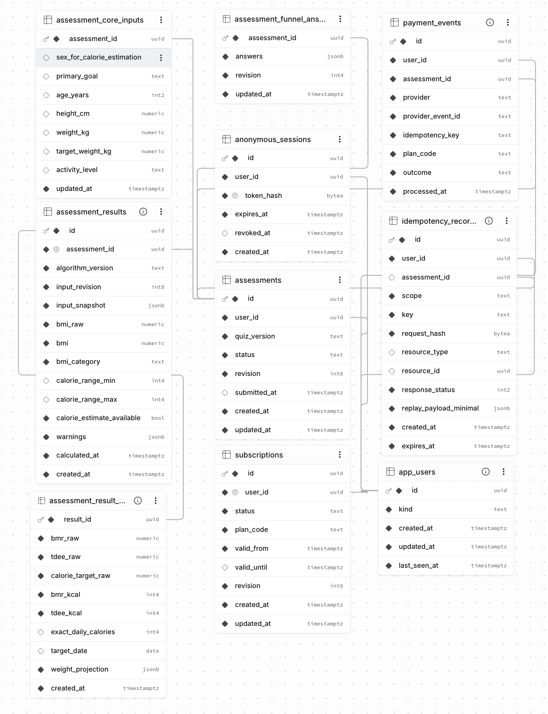

# Supabase Schema Visualizer snapshot

这张截图来自 Supabase 项目的 `public` schema，展示用户、匿名 session、assessment、结果、订阅、支付事件和幂等记录之间的真实关系。截图作为仓库证据保存，评审无需登录 Supabase 控制台即可查看。

配套的可渲染 Mermaid ERD 见 [assessment-erd.md](./assessment-erd.md)，字段约束、RLS、RPC 和索引说明见 [docs/database.md](../../docs/database.md)。
