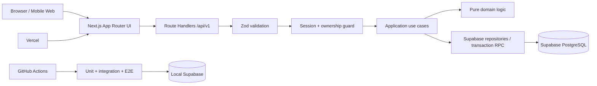

# 03 · 架构、模块边界与技术决策

## 总体架构



## 技术栈

| 层 | 选择 | 理由 |
|---|---|---|
| Runtime | Node.js 22 LTS，`.nvmrc` / `engines` 固定 | 当前 Supabase JS 已停止 Node 20 支持；22 稳定且部署兼容 |
| Package manager | pnpm + 锁文件 | 安装快、严格依赖、适合两天冲刺；版本写入 `packageManager` |
| Web | Next.js App Router 稳定版 | 单仓 UI + API、Vercel 部署路径短 |
| Language | TypeScript `strict` | 共享契约、减少边界错误 |
| Validation | Zod strict objects | 运行时验证、拒绝额外字段、可生成 OpenAPI |
| Database | Supabase PostgreSQL 17 | 用户指定；事务、约束、RLS、迁移、advisor |
| DB access | `@supabase/supabase-js` 的 server-only client + 受限 SQL RPC | 与托管项目一致；多表写入在数据库事务中完成 |
| Unit/Integration | Vitest + fast-check + local Supabase | 快速纯函数测试、性质测试、真实持久化语义 |
| Browser E2E | Playwright | 刷新恢复、付费闭环、移动端交互 |
| API docs | 手工维护 OpenAPI 3.1 + Zod contract tests | 两天内避免引入脆弱生成链，同时用测试防漂移 |
| CI | GitHub Actions | 自动证明 lint/typecheck/test/build/e2e |
| Hosting | Vercel + Supabase | 最短部署闭环，环境变量集成成熟 |

依赖在脚手架阶段锁定当日稳定版本，不使用 canary；Supabase 依赖与 CLI 都固定版本并提交 lockfile。

## 推荐目录

```text
README.md                   # 仓库总览、最终交付入口
src/
  app/
    README.md               # 前端/路由/状态约定
    api/v1/                 # 仅 HTTP 适配
    quiz/                   # funnel UI
    result/                 # 结果与 paywall
  server/
    README.md               # 后端模块、信任边界、扩展方式
    domain/                 # 纯算法、值对象、状态机、权限投影
    application/            # save/restore/submit/get-result/pay 用例
    infrastructure/         # Supabase client、repositories、clock/logger
    http/                   # session、problem details、idempotency、headers
  shared/contracts/         # Zod request/response schemas 与类型
supabase/
  README.md                 # migration、连接、ACL/RLS、部署/回滚
  migrations/               # Schema 唯一事实源
  seed.sql                  # 仅本地/CI 合成 fixture，不负责线上 demo
scripts/
  provision-demo-session.ts # 显式创建/轮换线上只读 paid fixture
tests/
  README.md                 # 独立测试阶段产物与覆盖映射
  unit/
  integration/
  contract/
  e2e/
docs/
  openapi.yaml
  schema.md
  testing.md
  security.md
  deployment.md
  ai-retrospective.md
```

仍是一个可部署的 Next.js 单仓应用，不拆成两个服务；“前端/后端各自 README”通过明确目录边界满足，避免两天内引入第二套 runtime、CORS 和部署面。

## ADR-001：单体 Next.js，而非 NestJS + 独立前端

**决定**：使用 Next.js Route Handlers 承载 API，但保持 controller/application/domain/repository 分层。
**原因**：2 天内减少部署、CORS、共享类型和环境配置成本；仍保留可测试的后端边界。
**代价**：必须防止业务逻辑进入 `route.ts`；由目录规则和测试约束。

## ADR-002：高熵匿名 session，而非完整账号体系

**决定**：创建 256-bit 随机 token，浏览器放在 `__Host-health_session`（`HttpOnly; Secure; SameSite=Lax; Path=/`，无 `Domain`）Cookie；数据库只存 SHA-256 digest；README cURL 使用标准 `Authorization: Bearer <sessionId>`。题面称它为 `sessionId`，内部记录 UUID 则称 `sessionRecordId`。
**原因**：符合题目允许的随机 UserID/Session，恢复体验无需登录，并可提供 paid demo session。
**约束**：

- token 只在创建时出现一次，日志只记 fingerprint；
- 内部 user UUID 不是凭证；
- 普通 session 绝对 TTL 7 天，不静默滑动；有到期/管理员撤销时间；
- 同时出现 Cookie 与 Bearer 且不一致时拒绝；Cookie 写请求在生产环境要求精确 `Origin`，纯 Bearer cURL 可不带 Origin；
- 已支付公开 fixture 属于 `demo_readonly` 用户，所有写 RPC 在数据库层拒绝；README 明确这是“允许公开的合成 demo credential”例外；
- 本版不做注册升级，也不预留未使用的 `auth_user_id` 列。

## ADR-003：强类型核心输入 + 扩展问答 JSONB

**决定**：年龄/身高/体重等放在一对一强类型表；仅非核心扩展题使用 `question_key + jsonb value`。
**拒绝方案**：把全部答案塞进一个 JSONB。它开发快，但削弱 CHECK、查询、类型与迁移能力，是本项目的 AI 否决案例候选。

## ADR-004：Step 使用 PUT、乐观锁和幂等键

**决定**：每步请求携带该步骤完整表示；`If-Match` 防丢失更新；`Idempotency-Key` 处理网络重放。
**原因**：语义比任意字段 PATCH 更清楚，测试可精确覆盖乱序/重复/并发。

## ADR-005：结果不可变、算法版本化

**决定**：submit 后 assessment 锁定；修改需要新建 assessment。结果保存输入快照和 `algorithm_version`。
**原因**：付费后结果可审计，不会因用户改草稿或算法升级悄悄变化。

## ADR-006：订阅状态实时查 DB，不放 JWT/前端

**决定**：每次结果读取根据 `status + valid_from + valid_until` 判断 entitlement。
**原因**：支付后立即生效，过期/取消立即收回；避免陈旧 JWT 和客户端伪造。

## ADR-007：多表一致性由数据库事务负责

**决定**：save、submit、pay 的关键写入通过受限、版本化的 PostgreSQL RPC 完成。每个 RPC 只接收 `session_hash`，在**同一事务**重新验证 session 未过期/未撤销/可写，派生 owner，再校验 assessment 所有权、revision 与幂等记录；绝不接受或信任 route 传入的 `userId`。函数使用 `SECURITY INVOKER`、固定空 `search_path`、全限定对象名，撤销默认执行权，只授权 server role。
**原因**：Next.js 里“先查后写”无法保证并发原子性。

Supabase secret/service role 具备 `BYPASSRLS`：RLS 的作用是让 public Data API 对 `anon` / `authenticated` fail closed，**不是**服务端 owner 授权。服务端 BOLA 防护由上述事务内 session→owner 解析和所有查询的 owner 条件承担。

## ADR-008：应用层与数据库双层校验

**决定**：Zod 返回用户友好 422；DB CHECK/unique/FK 是最后防线。两层边界由同一 ADR 表维护并测试一致性。
**原因**：防止绕过 API、脚本错误和未来新入口写入脏数据。

## 请求生命周期

```text
HTTP request
  → requestId
  → strict body/param/header validation
  → resolve session token digest
  → ownership guard (foreign resource appears as 404)
  → application use case
  → transaction + constraints
  → explicit response DTO
  → cache/security headers + structured log
```

## 不允许的依赖方向

- domain 不导入 Next.js、Supabase、环境变量或系统时钟。
- UI 不导入 server repositories。
- route handler 不直接拼 SQL，也不实现算法。
- repository 不决定 preview/full 权限文案。
- 测试 fixture 不使用真实用户数据或生产 token。
