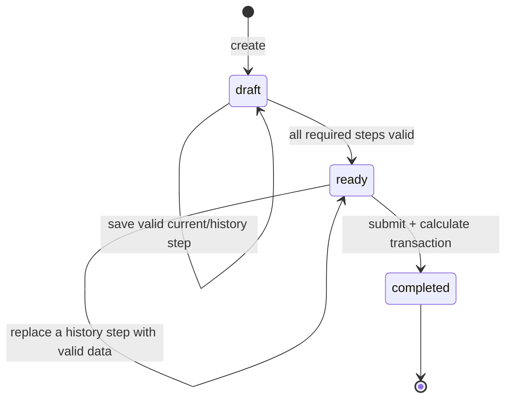

# 06 · 状态机、进度恢复、并发与幂等

## Assessment 状态机



- `ready` 是服务端推导状态，不接受客户端直接设置。
- 本版不存在 `ready → draft`：PUT 必须提供一个完整有效 step；会让整体无效的历史修改返回 422 并保留原值。
- 本版没有入口可达的 `abandoned` 状态。过期草稿由 retention maintenance 清理，不混入业务状态机。
- submit、basic/details result 插入和 completed 转换同事务；不存在“completed 但无 result”。
- completed 输入和结果均由数据库 trigger 阻止 update/delete；算法升级不会改写历史。

## Step 图与进度

MVP 固定步骤：

```text
sex → goal → body(age/height/weight/targetWeight) → activity → review → submit
```

`review` 是 UI 路由，不产生独立数据库字段或 step 状态。扩展题是 stretch；若加入必须由新的 `quiz_version` 固定，历史 assessment 按原版本解释。

- `completedSteps` 来自每个 required step 的完整有效数据。
- `nextStep` 是从起点开始第一个未完成 required step；全部完成时为 `review`。
- 不用“访问过的最大页面”、客户端 `currentStep` 或 localStorage 推导服务端进度。
- 历史 step 修改后重新执行跨字段校验；合法则 revision +1，状态仍为 ready 或 draft。

## 乱序策略

| 请求 | 行为 |
|---|---|
| 保存当前 `nextStep` | 接受 |
| 修改已完成的历史 step | 完整校验后接受；revision +1 |
| 重放同一个已成功请求 | 返回首次结果，不重复副作用 |
| 跳过缺失前置步骤保存未来 step | 409 `STEP_OUT_OF_ORDER` |
| ready 下提交会破坏整体合理性的历史值 | 422，旧值/状态/revision 均不变 |
| completed 后保存任何 step | 409 `ASSESSMENT_LOCKED` |

## 乐观并发

1. GET 返回 `revision` 与 `ETag: "rev-N"`。
2. 写请求必须发送 `If-Match: "rev-N"`。
3. RPC 在同一事务中解析 session owner，并锁定 assessment 或 compare-and-swap。
4. 成功业务写 revision 精确 +1。
5. 基于同一 revision 的两个不同请求只有一个成功，另一方 412。
6. 客户端收到 412 后重新 GET，展示最新值并由用户确认重试；不做 last-write-wins。

禁止应用层执行非原子的 `SELECT revision → 判断 → UPDATE`，否则存在 TOCTOU 和丢失更新。

## 幂等模型

### 输入规范

- `Idempotency-Key` 为 16–128 字符，仅 `[A-Za-z0-9._:-]`；服务端记录 TTL 24 小时。
- 请求先经过 strict Zod parse：错误类型、额外 key、超大 body 先拒绝，不能通过 canonicalization 悄悄丢字段。
- canonical hash 覆盖 method、route scope、session 派生 owner、resource、canonical body 和语义版本。
- Cookie、traceId、时间和重试时的旧 `If-Match` 不纳入 hash。

### 事务顺序

```text
BEGIN
  resolve valid writable session_hash → owner
  strict request already parsed by route
  lock/find (owner, scope, idempotency_key)
  ├─ found + same hash → return minimal stored replay/result reference
  ├─ found + different hash → 409
  └─ absent → verify If-Match/current state
               execute business write
               store minimal replay reference + status
COMMIT
```

这样网络重试即使携带提交前的旧 ETag，也能先命中同 key/same hash 并重放首次成功响应；新的 key 才按当前 revision 判断。幂等记录不保存 session token或重复整份健康结果。

只有产生业务写入或确定性 2xx outcome（如 `/pay` 的 `already_active`）才持久化幂等记录；解析、校验、401/403/404/409/412/422 等失败不缓存，修正请求后可重试。

## 写入不变量

### `save step`

- RPC 在同事务用 `session_hash` 验证有效/未撤销/非 `demo_readonly` 并派生 owner。
- assessment owner 匹配且未 completed。
- request revision 等于当前 revision，或已命中合法 replay。
- step 是当前或已完成历史 step；payload 通过应用与 DB 约束。
- 输入更新、状态/进度重算、revision 增长和幂等记录原子完成。

### `submit`

- 所有 required fields 完整，目标方向/比例/BMI 规则有效。
- result 尚不存在，或同一幂等请求返回既有 result。
- 计算使用事务内读取的 input snapshot 与一次性注入 UTC clock。
- basic result 与 protected details 都写成功后才标记 completed；任一故障整体回滚。

### `/pay`

- RPC 自己从 session 派生 owner；assessment 属于 owner 且已 completed。
- 不信任请求中的 user、金额、状态或客户端订阅信息。
- same idempotency key replay 不新增 event/不续期。
- 不同 key 并发时允许两条 attempt audit：第一条 `activated`，另一条 `already_active`；current subscription 仍最多一条，`valid_until` 只由赢家确定。
- event 插入、subscription upsert/读取 outcome 与幂等记录原子完成。
- result endpoint 每次实时读取 entitlement，支付成功后立即可观察；不从客户端状态“解锁”。

## Session 生命周期与 CSRF

- 无 credential 的 `POST /sessions` 才创建身份；有效 credential 调用时复用，过期 credential 返回 401。
- 普通 session 为 7 天绝对 TTL，不静默续期；公开 demo session 由 provisioning 脚本以 30 天为周期轮换。
- Cookie 和 Bearer 同时出现且不同返回 400；相同则视为同一 credential。
- 生产环境 Cookie 模式的 POST/PUT 必须存在精确匹配 `APP_ORIGIN` 的 Origin；纯 Bearer CLI 可省略。
- token 明文只在首次创建/显式 demo 轮换时出现，任何日志仅可记录不可逆短 fingerprint。

## 恢复与多标签页 UX

- 启动先 GET current；server state 是唯一已保存事实源。
- 健康数据（年龄、身高、体重、目标、选择答案）**不写 localStorage/sessionStorage**；输入中的未保存字符只保留 React 内存状态。
- localStorage 只允许无敏感的单位偏好、展示偏好或最后一个路由提示，不能用来恢复答案。
- 保存失败时页面内存保留当前输入并允许重试；刷新前清楚提示“尚未保存”。
- 多标签页收到 412 时不自动覆盖，提示“另一页面已更新”。
- session 过期后不能把旧健康草稿跨身份静默搬运；解释数据不可恢复并让用户显式重新开始。

## 时间与缓存一致性

- 授权与订阅有效期基于数据库 `now()`，不信任客户端时钟。
- 结果和恢复接口 dynamic + `private, no-store`。
- `/pay` 成功后前端重新 GET result；客户端不自行拼 full 数据。
- CDN/Next cache 不缓存带身份 JSON；contract/E2E 对响应头和支付后即时变化做断言。
